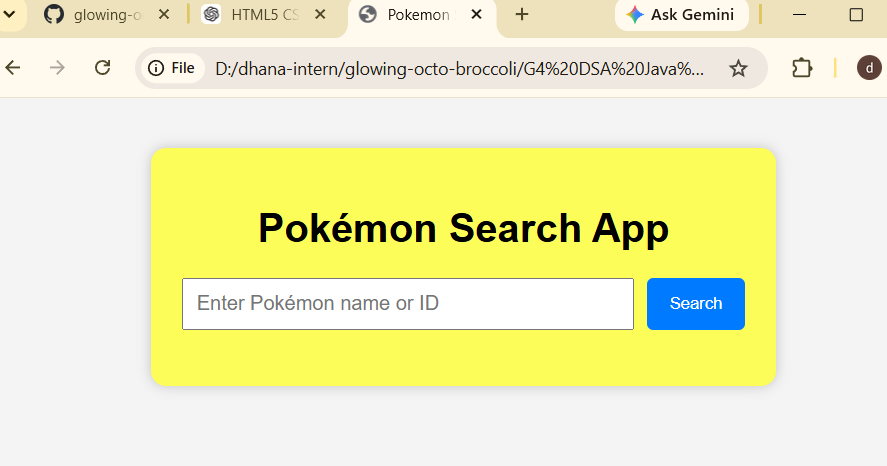
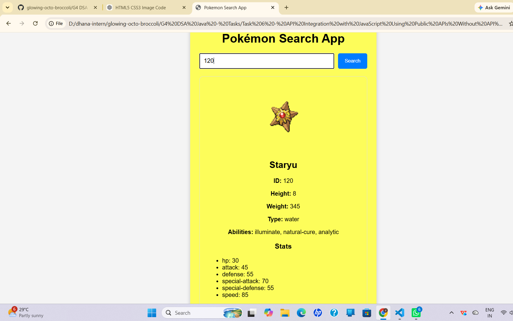
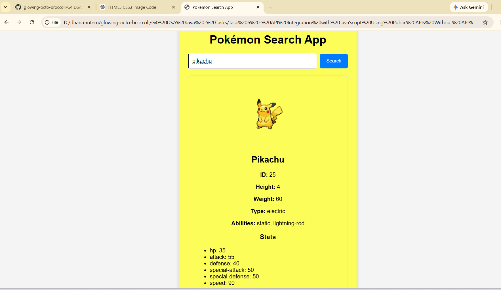
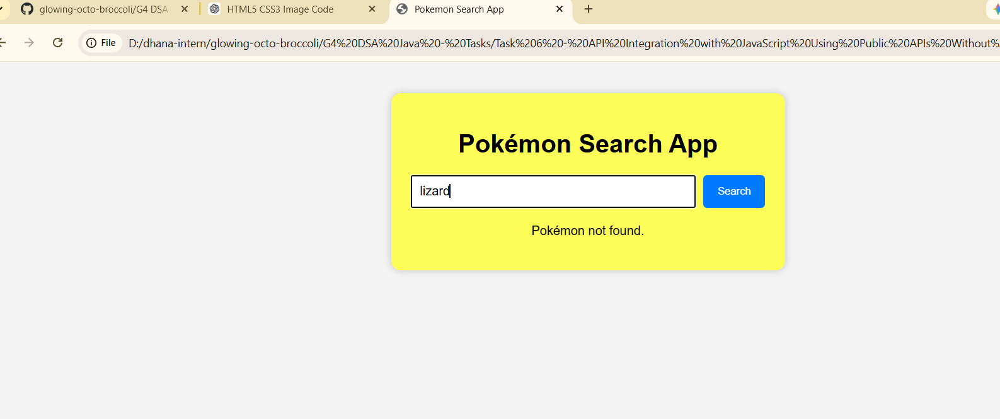

# Pokémon Search App

## Project Overview

The Pokémon Search App is a simple web application built using **HTML, CSS, and JavaScript**. It integrates with the **PokéAPI** to fetch and display Pokémon information based on the user's input.

The application demonstrates API integration using the JavaScript `fetch()` method and dynamically displays Pokémon details on the webpage.

---

## Features

- Search Pokémon by **Name**
- Search Pokémon by **ID**
- Display Pokémon Image
- Display Name
- Display ID
- Display Height
- Display Weight
- Display Types
- Display Abilities
- Display Base Stats
- Loading Message
- Error Handling
- Input Validation

---

## Technologies Used

- HTML5
- CSS3
- JavaScript (ES6)
- Fetch API
- PokéAPI

---

## How to Run the Project

1. Download or clone the project.
2. Open the project folder.
3. Open **index.html** using Live Server in Visual Studio Code.
4. Enter a Pokémon name or ID.
5. Click the **Search** button.

---

# Testing the Application

## Search by Name

Enter

```
pikachu
```

Click **Search**

The application should display

```
Image

Name: Pikachu

ID: 25

Height: 4

Weight: 60

Type: electric

Abilities:
- static
- lightning-rod

Stats:
- HP
- Attack
- Defense
- Speed
- ...
```

---

## Search Another Pokémon

Enter

```
charizard
```

Click **Search**

The application should display Charizard's information.

---

## Search by Pokémon ID

Enter

```
150
```

Click **Search**

The application should display

```
Mewtwo
```

---

## Invalid Search

Enter

```
abcdxyz
```

Click **Search**

The application should display

```
Pokémon not found.
```

---

## Empty Input

Leave the textbox empty.

Click **Search**

The application should display

```
Please enter a Pokémon name or ID.
```

---
# Screenshots

## 1. Home Screen

The home screen is displayed when the application is first opened. It provides a search bar where users can enter a Pokémon name or ID and click the **Search** button to retrieve Pokémon information.



---

## 2. Search Using Pokémon ID

The application allows users to search for a Pokémon by entering its numeric ID. In this example, the user searches for **120**, and the application displays the details of **Staryu**, including its image, ID, height, weight, type, abilities, and base stats.



---

## 3. Search Using Pokémon Name

Users can also search using a Pokémon's name. In this example, the user enters **pikachu**, and the application successfully retrieves and displays Pikachu's image along with its ID, height, weight, type, abilities, and base statistics.



---

## 4. Invalid Search (Error Handling)

If the user enters an invalid Pokémon name or ID, the application displays an appropriate error message instead of crashing. This ensures a better user experience by informing the user that the requested Pokémon could not be found.

**Example Error Message:**

```
Pokémon not found.
```


# How the Project Works

```
User enters:

pikachu
      │
      ▼
JavaScript reads input
      │
      ▼
fetch()
      │
      ▼
     API
      ▼
PokéAPI sends JSON data
      │
      ▼
JavaScript extracts:
- Name
- Image
- Height
- Weight
- Types
- Abilities
- Stats
      │
      ▼
Displays the data on the webpage
```

---

## JSON Data Used

The application extracts the following properties from the API response.

| Property | Description |
|----------|-------------|
| name | Pokémon name |
| id | Pokémon ID |
| sprites.front_default | Pokémon image |
| height | Pokémon height |
| weight | Pokémon weight |
| types | Pokémon types |
| abilities | Pokémon abilities |
| stats | Pokémon base statistics |

---

## Project Structure

```
pokemon-search-app/

│── index.html
│── style.css
│── script.js
│── README.md
```

---

## Learning Outcomes

This project demonstrates the following JavaScript concepts:

- DOM Manipulation
- Event Handling
- Fetch API
- API Integration
- JSON Parsing
- Template Literals
- Async/Await
- Error Handling
- Input Validation
- Dynamic API URL Generation

---

## Future Improvements

- Display Pokémon moves
- Display Pokémon evolution chain
- Display multiple Pokémon images
- Add dark mode
- Add search history
- Add responsive design improvements

---


**Dhanalaxmi Ravela**
