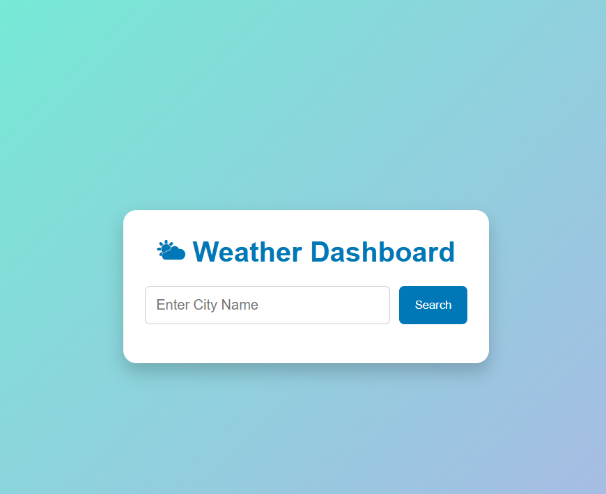
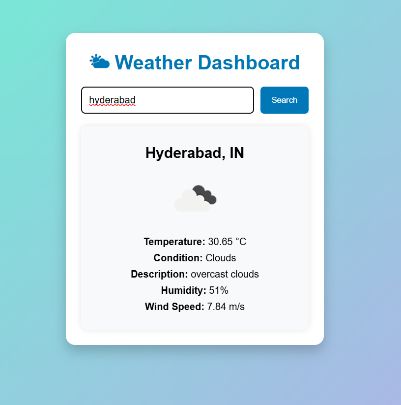
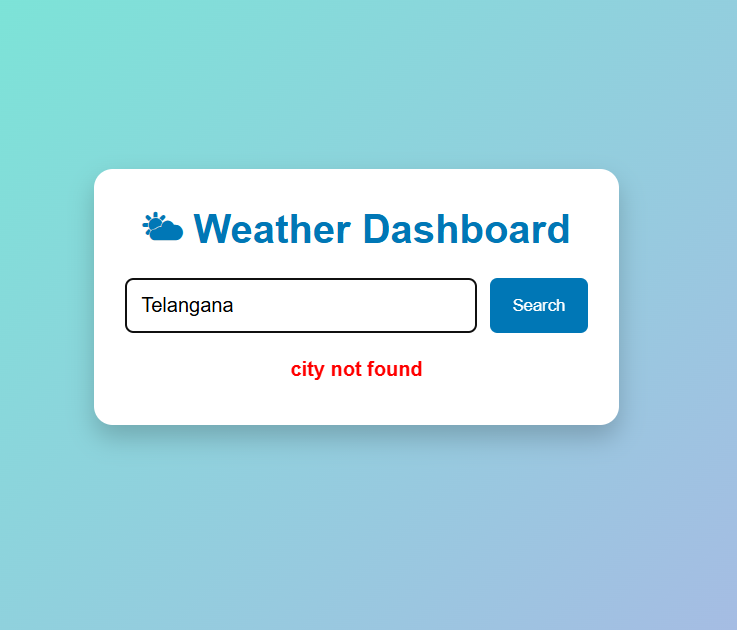

# 🌤 Weather Dashboard

A simple Weather Dashboard web application built using **HTML5, CSS3, and JavaScript**. The application integrates with the **OpenWeather API** to fetch and display real-time weather information for any city entered by the user.

---

# Project Objectives

- Learn API Integration using JavaScript
- Understand how to use an API Key securely
- Practice asynchronous programming using Fetch API
- Parse JSON responses
- Display dynamic data on a web page
- Handle loading states and errors gracefully

---

# Technologies Used

- HTML5
- CSS3
- JavaScript (ES6)
- Fetch API
- OpenWeather API

---

# Selected API

## OpenWeather API

The OpenWeather API provides real-time weather information for cities around the world.

Website:

https://openweathermap.org/

API Endpoint:

https://api.openweathermap.org/data/2.5/weather

---

# Why I Selected This API

I selected the OpenWeather API because it provides accurate and real-time weather information. It is easy to integrate using JavaScript's Fetch API and returns weather data in JSON format, making it suitable for learning API integration concepts.

---

# Features

- Search weather by city name
- Displays city and country
- Displays current temperature
- Displays weather condition
- Displays weather description
- Displays humidity
- Displays wind speed
- Displays weather icon
- Input validation
- Loading indicator
- Error handling
- Responsive user interface

---

# Folder Structure

```text
weather-dashboard/

│── index.html
│── style.css
│── script.js
│── config.example.js
│── .gitignore
│── README.md
│── screenshots/
│     ├── home.png
│     ├── weather-result.png
│     └── error-message.png

(config.js is stored locally and is not uploaded.)
```

---

# Project Setup

## Step 1

Clone or download the project.

---

## Step 2

Create a file named

```
config.js
```

inside the project folder.

---

## Step 3

Add your OpenWeather API Key.

```javascript
const API_KEY = "YOUR_API_KEY";
```

---

## Step 4

Open

```
index.html
```

using Live Server in Visual Studio Code.

---

# API Request URL

```text
https://api.openweathermap.org/data/2.5/weather?q={CITY_NAME}&appid={API_KEY}&units=metric
```

Example

```text
https://api.openweathermap.org/data/2.5/weather?q=London&appid=YOUR_API_KEY&units=metric
```

---

# API Response Fields Used

| JSON Field | Description |
|------------|-------------|
| name | City Name |
| sys.country | Country Code |
| main.temp | Temperature in Celsius |
| weather[0].main | Weather Condition |
| weather[0].description | Detailed Weather Description |
| main.humidity | Humidity Percentage |
| wind.speed | Wind Speed |
| weather[0].icon | Weather Icon |

---

# How the Project Works

```
User enters city name
        │
        ▼
JavaScript reads input
        │
        ▼
Fetch API sends request
        │
        ▼
OpenWeather API
        │
        ▼
JSON Response
        │
        ▼
Extract Weather Details
        │
        ▼
Display Weather Information
```

---

# Testing

## Valid City

Input

```
London
```

Output

- Weather Information
- Temperature
- Humidity
- Wind Speed
- Weather Icon

---

## Another City

Input

```
Hyderabad
```

Output

Displays Hyderabad weather information.

---

## Invalid City

Input

```
abcdxyz
```

Output

```
City not found
```

---

## Empty Input

Click Search without entering a city.

Output

```
Please enter a city name.
```

---
# Screenshots

## Home Screen

Shows the Weather Dashboard before searching for any city.



---

## Weather Search Result

Displays weather information for a valid city.



---

## Error Message

Displays an error when the user enters an invalid city name.



# Security

The project stores the API key inside

```
config.js
```

This file is ignored using

```
.gitignore
```

to prevent exposing the API key publicly.

The repository includes

```
config.example.js
```

as a template for other users.

---

# Future Improvements

- 5-day Weather Forecast
- Dark Mode
- Geolocation Support
- Search History
- Temperature Unit Toggle (°C / °F)
- Better Responsive Design

---

# Author

**Dhanalaxmi Ravela**

B.Tech Final Year Student
